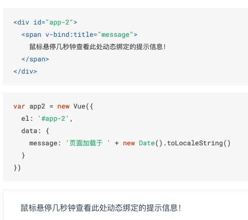

# let 和 var 的区别

````
let a = 1;
a = 2;

function(){
    var c = 1;
    function(){
        c
    }
}

if(...) {
    let a = ...;
}
a
````

let 的作用域仅限于大括号内

var 的作用域在函数内, 可以穿透任何大括号， 除了定义函数的大括号。

var 的声明会自动提升, 运行环境会自动把 var 声明提前到作用域到顶部

var 很多奇怪到行为，然后作用域也太大了，目前不推荐使用。2015年之前到浏览器不支持 let


# git 

git 是版本控制程序，功能：

1. 记录代码修改

2. 方便多人协作

## 初始化 git 工程

    git init

## 添加文件到 git

    git add

## 提交历史记录

    git commit -m 'xxxxx'

## 查看提交历史

vs code 用 gitlens 插件查看提交历史

    git log

## 创建一个新分支

    git checkout -b xxxx

## 切换分支

    git checkout xxxx

## 合并分支

    git merge xxxx

## 连接到网上

    git remote add origin git@github.com:mmjang/ahaha.git

## 别人克隆

    git clone git@github.com:mmjang/ahaha.git

## 上传

    git push

## 下载

    git pull

# navigator

navigator.language

navigator.userAgent

navigator.platform

# location

location.href

location.host

location.hash 

location.search

# history

history.back()

history.forward()

history.length

# vue




